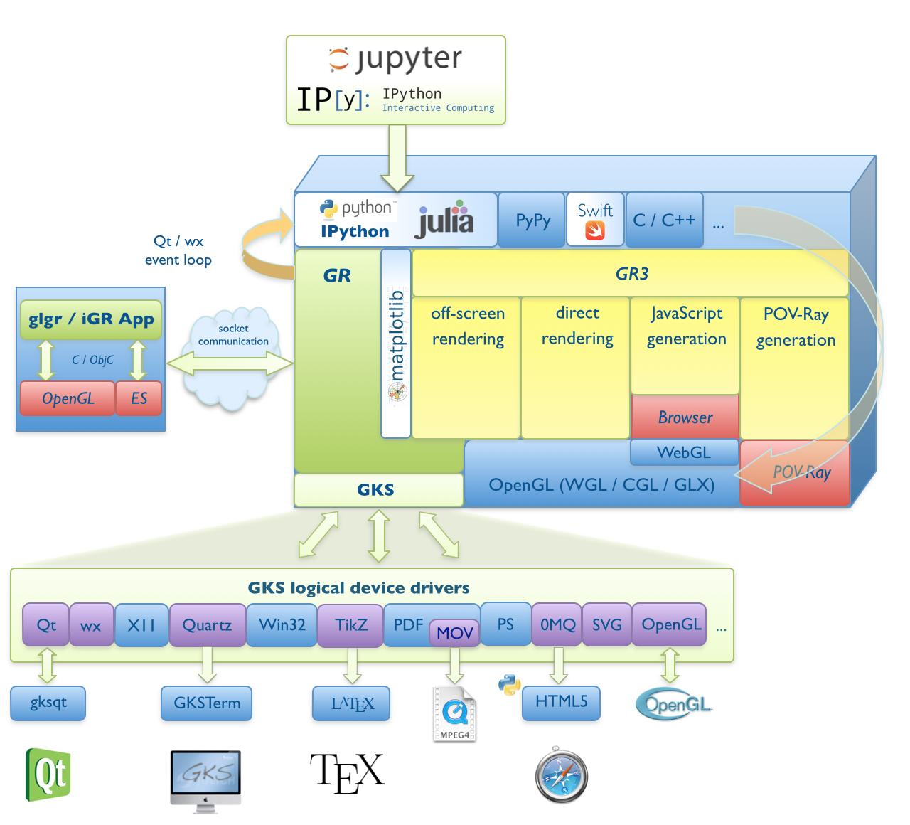

About the GR Framework
======================

*GR* is essentially based on an implementation of a Graphical Kernel System (GKS)
and *OpenGL*. As a self-contained system it can quickly and easily be integrated
into existing applications (i.e. using the ``ctypes`` mechanism in
`Python <https://python.org>`_ or direct calls from
`Julia <https://julialang.org>`_ with ``ccall`` syntax).

The *GR* framework can be used in imperative programming systems or integrated
into modern object-oriented systems, in particular those based on GUI toolkits.
*GR* is characterized by its high interoperability and can be used with modern
web technologies and mobile devices. The *GR* framework is especially suitable
for real-time environments.

----

*GR* was developed by the `Scientific IT-Systems <https://pgi-jcns.fz-juelich.de>`_ group at the `Peter Grünberg Institute <https://www.fz-juelich.de/pgi>`_
at `Forschunsgzentrum Jülich <https://www.fz-juelich.de>`_.
The main development has been done by Josef Heinen who currently maintains
the software.

*GR3* is a software library for simple visualization of 3D scenes.
It was developed by Florian Rhiem as part of his bachelor's thesis.
*GR3* is written in C and can also be used from *Python* or *Julia* through
a wrapper module.

Starting with release 0.6 *GR* can be used as a backend
for `Matplotlib <https://matplotlib.org>`_ and significantly improve
the performance of existing Matplotlib or PyPlot applications written
in Python or Julia, respectively.
In :doc:`this <tutorials/matplotlib>` tutorial section you can find
some examples.

Beginning with version 0.10.0 *GR* supports inline graphics which shows
up in IPython's Qt Console or interactive computing environments for *Python*
and *Julia*, such as `IPython <https://ipython.org>`_ and
`Jupyter <https://jupyter.org>`_.
A simple *IPython* notebook example (converted to HTML5) can be found
`here <https://pgi-jcns.fz-juelich.de/pub/doc/700K_460.html>`_.

**Other resources**

* The GR framework has already been presented in a talk at PyCon DE `2012 <https://2012.de.pycon.org/programm/schedule/sessions/54>`_ and `2013 <https://2013.de.pycon.org/schedule/sessions/45/>`_, during a `poster session <https://us.pycon.org/2013/schedule/presentation/158/>`_ at PyCon US 2013, at `PythonCamps 2013 <https://josefheinen.de/rasberry-pi.html>`_ in Cologne, at EuroPython `2014 <https://ep2014.europython.eu/en/schedule/sessions/86/>`_ and `2015 <https://ep2015.europython.eu/conference/talks/speeding-up-matplotlib-with-gr>`_, at `EuroSciPy 2015 <https://www.euroscipy.org/2015/schedule/presentation/12/>`_, JuliaCon `2015 <https://juliacon.org/2015/>`_ and `2016 <https://juliacon.org/abstracts.html#GR>`_, and `SciPy 2016 <https://scipy2016.scipy.org/ehome/146062/332965/>`_. The are also HTML versions of the talks at `PyCon.DE 2013 <https://pgi-jcns-ta.fz-juelich.de/pub/doc/PyCon_DE_2013>`_, EuroPython `2014 <https://pgi-jcns-ta.fz-juelich.de/pub/doc/EP14>`_ and `2015 <https://pgi-jcns.fz-juelich.de/pub/doc/EP15/talk>`_, JuliaCon `2015 <https://pgi-jcns-ta.fz-juelich.de/pub/doc/JuliaCon_2015/html>`_ and `2016 <https://pgi-jcns-ta.fz-juelich.de/pub/doc/JuliaCon_2016/html>`_, `EuroSciPy 2015 <https://pgi-jcns.fz-juelich.de/pub/doc/EuroSciPy_2015/00-talk>`_ and `SciPy 2016 <https://pgi-jcns.fz-juelich.de/pub/doc/SciPy_2016/html>`_.

* There is an active developer group and :doc:`list <credits>` of people who have made significant contributions. More information can be found :doc:`here <references>`.

Workstation Types
-----------------

The layered architecture of GR and GKS allow the use of a wide variety of GUI toolkits and file formats using so-called workstations. You can select the workstation by setting the ``GKS_WSTYPE`` environment variable or by explicitly opening it using ``gks_openws``.

========== ============ ===========
Plugin     GKS_WSTYPE   Description
========== ============ ===========
*built-in* pdf          PDF file
*built-in* ps           PostScript file
cairo      png          4096×4096 PNG file
========== ============ ===========

.. note:: List all available workstation types and output formats