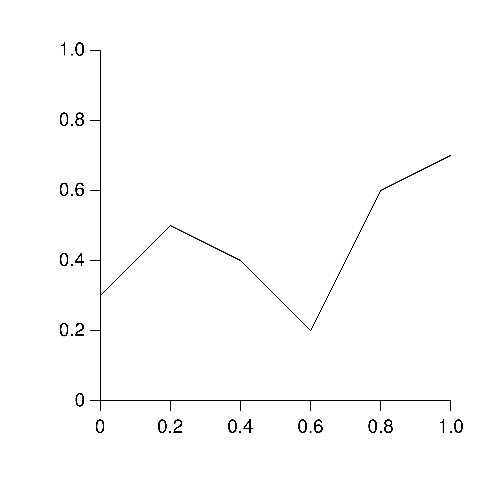

C library GR
============

Installation
------------

You can manually install prebuilt binaries for the GR runtime or install a `Linux package <#linux-packages>`_.

================ ============ =======================================================================================================
Operating System Architecture
================ ============ =======================================================================================================
macOS            x86_64       `gr-latest-Darwin-x86_64.tar.gz <https://gr-framework.org/downloads/gr-latest-Darwin-x86_64.tar.gz>`_
macOS            aarch64      `gr-latest-Darwin-aarch64.tar.gz <https://gr-framework.org/downloads/gr-latest-Darwin-aarch64.tar.gz>`_
macOS            universal    `gr-latest-Darwin-universal.tar.gz <https://gr-framework.org/downloads/gr-latest-Darwin-universal.tar.gz>`_
Debian           x86_64       `gr-latest-Debian-x86_64.tar.gz <https://gr-framework.org/downloads/gr-latest-Debian-x86_64.tar.gz>`_
Debian           aarch64      `gr-latest-Debian-aarch64.tar.gz <https://gr-framework.org/downloads/gr-latest-Debian-aarch64.tar.gz>`_
Debian           armhf        `gr-latest-Debian-armhf.tar.gz <https://gr-framework.org/downloads/gr-latest-Debian-armhf.tar.gz>`_
Ubuntu           x86_64       `gr-latest-Ubuntu-x86_64.tar.gz <https://gr-framework.org/downloads/gr-latest-Ubuntu-x86_64.tar.gz>`_
CentOS 7         x86_64       `gr-latest-CentOS-x86_64.tar.gz <https://gr-framework.org/downloads/gr-latest-CentOS-x86_64.tar.gz>`_
CentOS 7         i386         `gr-latest-Linux-i386.tar.gz <https://gr-framework.org/downloads/gr-latest-Linux-i386.tar.gz>`_
Arch Linux       x86_64       `gr-latest-ArchLinux-x86_64.tar.gz <https://gr-framework.org/downloads/gr-latest-ArchLinux-x86_64.tar.gz>`_
FreeBSD          x86_64       `gr-latest-FreeBSD-x86_64.tar.gz <https://gr-framework.org/downloads/gr-latest-FreeBSD-x86_64.tar.gz>`_
Windows (MinGW)  x86_64       `gr-latest-Windows-x86_64.tar.gz <https://gr-framework.org/downloads/gr-latest-Windows-x86_64.tar.gz>`_
Windows (MinGW)  i686         `gr-latest-Windows-i686.tar.gz <https://gr-framework.org/downloads/gr-latest-Windows-i686.tar.gz>`_
Windows (MSVC)   x86_64       `gr-latest-Windows-x86_64-msvc.tar.gz <https://gr-framework.org/downloads/gr-latest-Windows-x86_64-msvc.tar.gz>`_
================ ============ =======================================================================================================

You may need to install some additional dependencies on Linux:

- Debian:
   ``apt install libxt6 libxrender1 libxext6 libgl1-mesa-glx libqt6widgets6``
- Ubuntu:
   ``apt install libxt6 libxrender1 libxext6 libglx-mesa0 libqt6widgets6``
- CentOS / Fedora / Rocky Linux:
   ``yum install libXt libXrender libXext mesa-libGL qt6-qtbase-gui``
- openSUSE:
   ``zypper install libXt6 libXrender1 libXext6 Mesa-libGL1 libQt6Widgets6``
- Arch Linux:
   ``pacman -S mesa qt6-base``

**Note**: Depending on the Linux flavor you are using, the package names may differ from the ones mentioned here. This particularly applies to the Qt versions used.

On FreeBSD make sure to install the these packages:
   ``pkg install libXt libXrender libXext mesa-libs qt6``

For other versions of GR, see the `downloads <https://gr-framework.org/downloads/>`_.
For information on building the GR runtime yourself, see
`Building the GR Runtime <building.html>`_.

Docker and other headless Linux systems
^^^^^^^^^^^^^^^^^^^^^^^^^^^^^^^^^^^^^^^

- GR does not rely on X11 for its non-interactive output formats, so you will
  not need the dependencies listed above on a headless system.
- GR3 uses GLX for OpenGL context creation, which requires a connection to an X
  server. If X, GLX or OpenGL is not available, GR3 will fall back to a
  built-in software renderer which implements all GR3 functionality except for
  volume rendering. If you are using a headless sytem, e.g. a Docker container,
  and want to use :c:func:`gr_volume`, you can use Xvfb or similar tools to
  start an X server that can be used by GR3.

Linux packages
^^^^^^^^^^^^^^

Since GR v0.17.2 we provide `python-gr` `.rpm` and `.deb` packages for various
Linux distributions using
`openSUSE Build Service <https://build.opensuse.org>`_. Your operating systems
package manager will cope with package dependencies.

Please follow the installation instructions for your operating system described
`here <https://software.opensuse.org/download.html?project=science:gr-framework&package=gr>`_.

We also provide Arch packages for C, Python and JavaScript GR on the `Arch User Repository
<https://aur.archlinux.org>`_:

================================================================================ =======================================
AUR package name                                                                 Description
================================================================================ =======================================
`gr-framework <https://aur.archlinux.org/packages/gr-framework/>`_               Latest stable version of C GR
`gr-framework-git <https://aur.archlinux.org/packages/gr-framework-git/>`_       Latest development version of C GR
`python-gr-framework <https://aur.archlinux.org/packages/gr-framework/>`_        Latest stable version of Python GR
`python-gr-framework-git <https://aur.archlinux.org/packages/gr-framework/>`_    Latest development version of Python GR
`gr-framework-js <https://aur.archlinux.org/packages/gr-framework-js/>`_         Latest stable version of `gr.js`
`gr-framework-js-git <https://aur.archlinux.org/packages/gr-framework-js-git/>`_ Latest development version of `gr.js`
================================================================================ =======================================

If you would like to generate video output, make sure the ``ffmpeg`` package is installed before getting any package
from the AUR.

You can either install these AUR packages manually (see the
`Arch wiki <https://wiki.archlinux.org/index.php/Arch_User_Repository#Installing_packages>`_ for help) or by using an
AUR helper like `yay <https://github.com/Jguer/yay>`_:

.. code-block:: bash

    yay -S python-gr-framework

In this example, ``yay`` will install C GR (package ``gr-framework``) as a dependency automatically.

Getting Started
---------------

After installing GR, you can try it out by creating a simple plot:

.. code-block:: C

   #include <stdio.h>
   #include <gr.h>

   int main(void) {
       double x[] = {0, 0.2, 0.4, 0.6, 0.8, 1.0};
       double y[] = {0.3, 0.5, 0.4, 0.2, 0.6, 0.7};
       gr_polyline(6, x, y);
       gr_axes(gr_tick(0, 1), gr_tick(0, 1), 0, 0, 1, 1, -0.01);
       // Press any key to exit
       getc(stdin);
       return 0;
   }

To compile and link this example on Linux or macOS, you can run:
``cc -I<grdir>/include -L<grdir>/lib -Wl,-rpath,<grdir>/lib -lGR example.c -o example``
where you replace ``<grdir>`` with the path to your installation of GR.

Tutorials
---------

You can find several tutorials on using GR in the :doc:`Tutorials <tutorials/index>` section.

API Reference
-------------

The C API for GR consists of:

.. toctree::

    c-grm.rst
    c-gr.rst
    c-gr3.rst
    c-gks.rst
