Editor & Interactions
=====================

Viewer
------

The standard GRPlot plot view enables various interactions, such as panning and box zooming. To do this, either scroll
or right-click and drag a box. You can also move the coordinate system window around.

|zoom| |move|

Hovering over a data point will show the x- and y-values, as well as the label or z-data, if applicable. In addition, if
you press the Shift key, all y-data and labels/z-data at that specific x-value will be shown inside the tooltip.

|tooltip| |shift|

The view can be reset using the ``r`` key or by double-clicking.

Toolbar
-------

The toolbar is part of the GRPlot widget. This allows you to quickly change certain aspects of the plot.

|toolbar|

+------------------+---------------------------------------------------------------------------------------------------+
| Icon             | Description                                                                                       |
+==================+===================================================================================================+
| |kind|           | This icon allows you to transform series. For example, line plots can be converted into scatter   |
|                  | plots with one click.                                                                             |
+------------------+---------------------------------------------------------------------------------------------------+
| |algorithm|      | This allows you to change the marginal heatmap algorithm.                                         |
+------------------+---------------------------------------------------------------------------------------------------+
| |log|            | You can display the axes logarithmically with one click.                                          |
+------------------+---------------------------------------------------------------------------------------------------+
| |flip|           | Allows flipping every axis.                                                                       |
+------------------+---------------------------------------------------------------------------------------------------+
| |lim|            | The limits of each individual axis can be changed.                                                |
+------------------+---------------------------------------------------------------------------------------------------+
| |orientation|    | This allows the x- and y-axis values to be swapped.                                               |
+------------------+---------------------------------------------------------------------------------------------------+
| |aspect_ratio|   | It allows you to either keep the aspect ratio or force a quadratic aspect ratio for certain types |
|                  | of plot.                                                                                          |
+------------------+---------------------------------------------------------------------------------------------------+
| |location|       | You can change the position of the color bar and legend.                                          |
+------------------+---------------------------------------------------------------------------------------------------+
| |use_gr3|        | This icon is only useful for swapping the underlying algorithm in surface plots.                  |
+------------------+---------------------------------------------------------------------------------------------------+
| |polar_with_pan| | This is only available for polar plots to enable panning and zooming.                             |
+------------------+---------------------------------------------------------------------------------------------------+
| |colormap|       | The color map used can be changed.                                                                |
+------------------+---------------------------------------------------------------------------------------------------+
| |text_color_ind| | Change the color or the scaling of the text.                                                      |
+------------------+---------------------------------------------------------------------------------------------------+
| |disable_grid|   | This is used to enable or disable the grid in two-dimensional plots.                              |
+------------------+---------------------------------------------------------------------------------------------------+
| |multiplot|      | It is used to apply quick changes to multiplots, such as the use of consecutive colour bars.      |
+------------------+---------------------------------------------------------------------------------------------------+

Menubar
--------

The menu has four submenus. The first is the File menu, which allows you to save the plot to an XML/PNG file. This can
be used to load the file later and restore the plot. In addition, it is possible to export the plot to a variety of
other raster and vector graphics formats, including (pure) PNG, JPEG, PDF and SVG.

|file_menu|

The toolbar and the option to move elements inside the editor can be deactivated via the Modi submenu.
The grid can also be made selectable inside the editor.

|modi_menu|

The toolbar and the option to move elements inside the editor can be deactivated via the Modi submenu. The grid can also
be made selectable inside the editor.

|data_menu|

When the 'Show data context' action is triggered, a dock widget containing a tabular view of all used context keys and
their data will appear on the left side of the window. A context key is simply a reference from a series element to its
data, and this can also be quickly accessed from the edit element widget. In this case, the relevant column is
highlighted, while a selected column highlights the plot element which uses that data.

|data_view| |context_key_ref|

The Editor menu can be used to enable Editor view. Once enabled, this menu can be used to switch back to the normal view.
It can also be used to enable the tree view, which displays the underlying XML tree.

|enable_editor| |editor_menu|

Editor view
-----------

If the editor view is enabled, multiple new options become available. Firstly, normal interactions with the plot, such
as panning, are disabled, and every mouse movement highlights the elements displayed under the cursor. This way, the
user knows what they could change at that specific location, and a click selects that element. The attributes of that
element can then be changed in the newly opened dock widget and applied to the plot. Any red attribute in the list is
valid for the selected element, but has not yet been set. Hover over any attribute to get a tooltip with a short
explanation of that attribute. To disable the editor completely use ``GRDISPLAY=view``.

|select_series| |edit_element|

Any changes made can be undone or redone using the options in the editor menu. This is restricted to the last five
changes.

Another feature of the editor view is the ability to add text or overlay elements (pictures) at the mouse position by
right-clicking. Newly inserted text or overlay elements can be dragged and resized by their corners. More complex
additions can only be made with the advanced editor, which requires a greater understanding of the tree structure. This
involves selecting the correct parent element and setting all the necessary attributes.

|right_click|

Elements can also be moved within the editor view. To do this, press the control key (command on Mac) before clicking on
an element. If the advanced editor is not enabled, only important elements can be moved. If more than one element is
selected for movement, an element intersection will be shown, allowing similar attributes to be changed on all selected
elements. You can also resize an element if the cursor is at the edge of it.

|move_element| |element_intersection|

To remove an existing element, select it and then press Backspace or Delete. Press Escape to deselect everything.

All of these options are also available for the tree view, which can be opened via the Editor menu. Clicking on an
element in the tree view opens the corresponding element edit window, while the checkboxes can be used to move elements.

|tree_view|

.. |enable_editor| image:: images/tutorial/enable_editor.png
                   :width: 49%
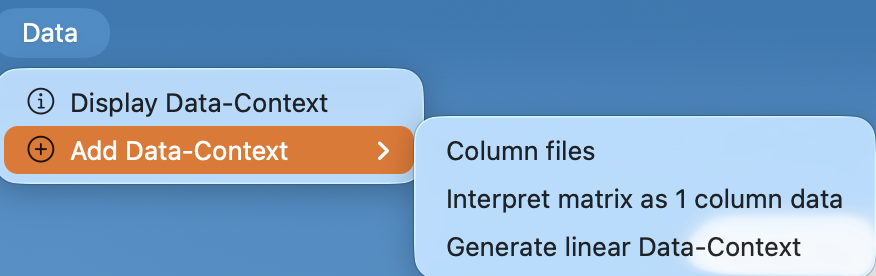
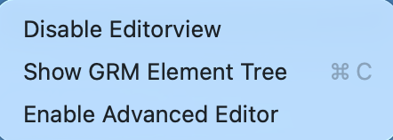
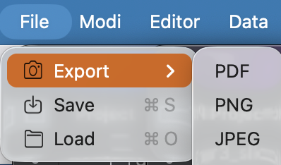
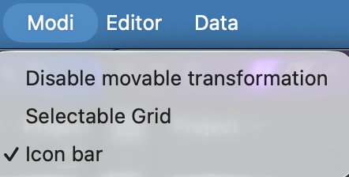
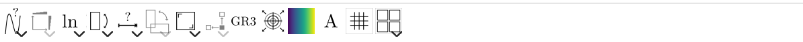
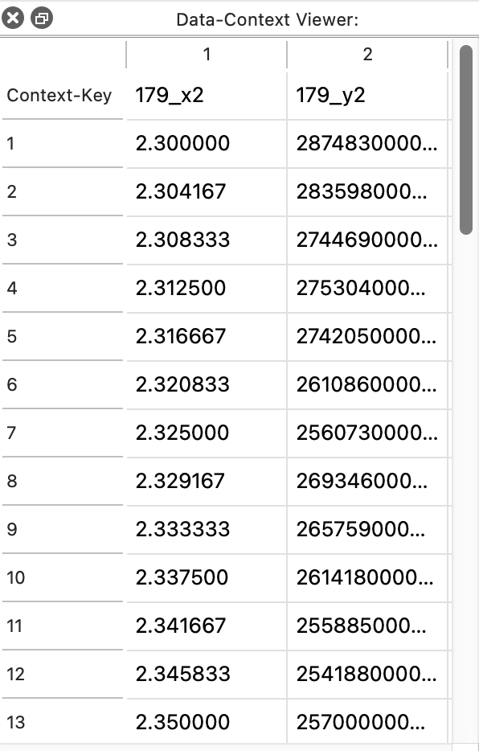
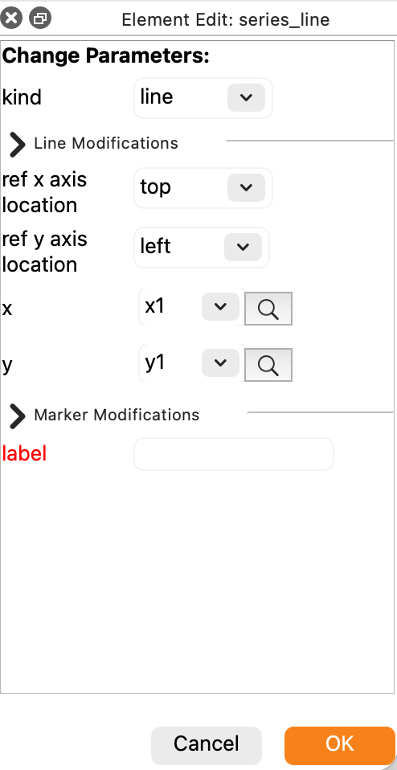
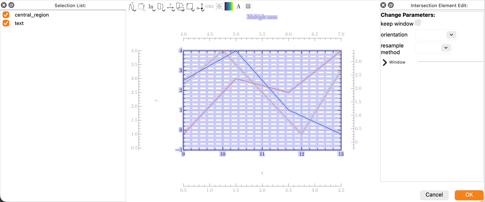
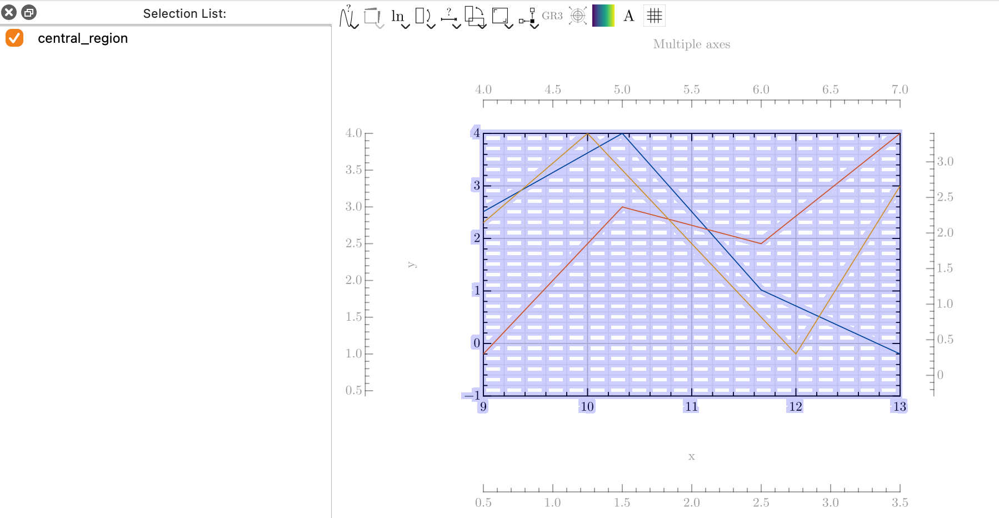
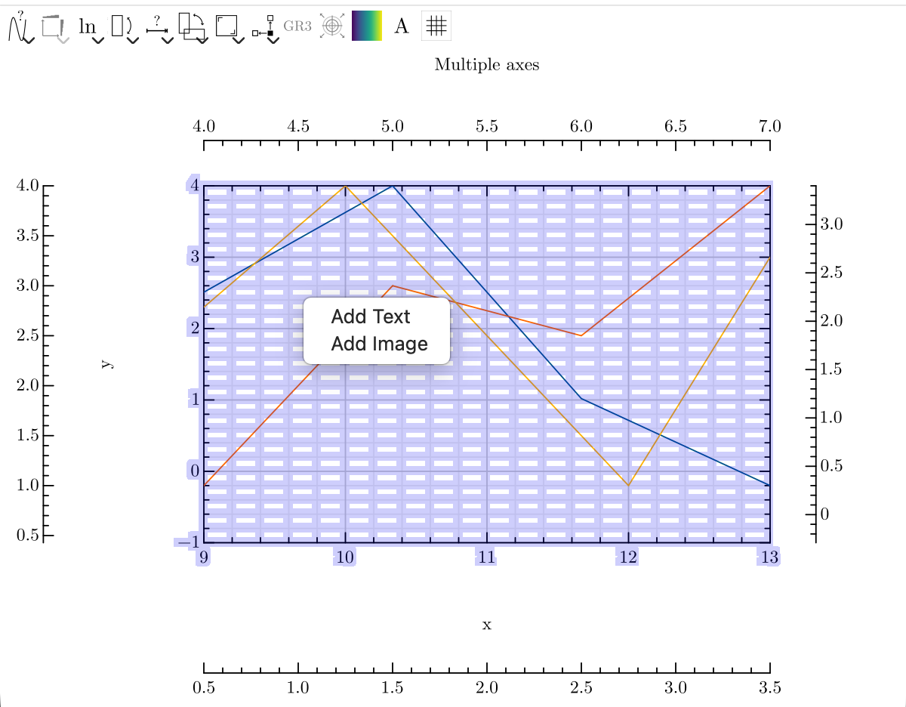
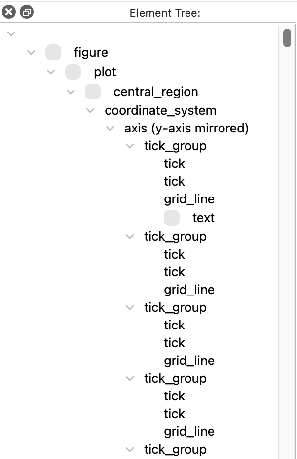
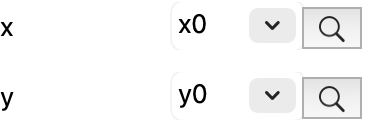
.. |select_series| image:: images/tutorial/select_series.png
                   :width: 69%
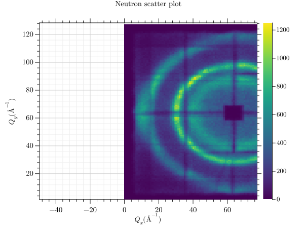
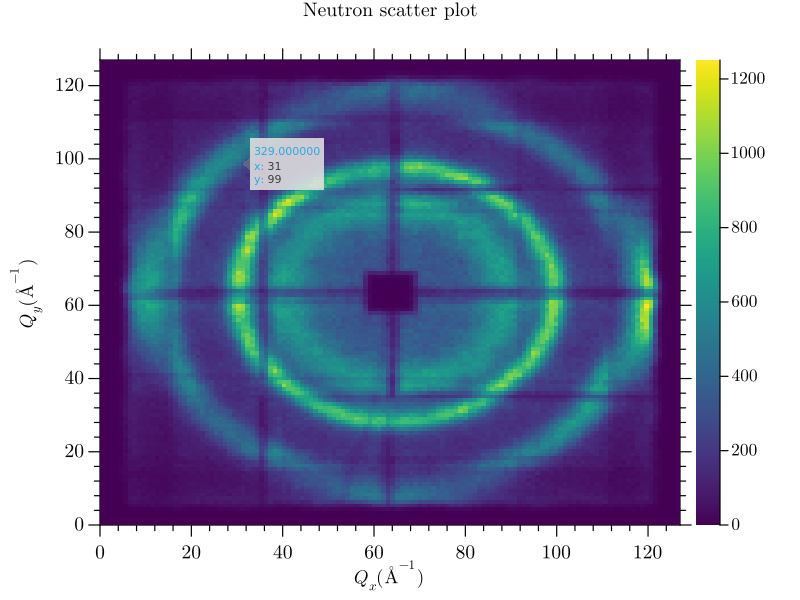
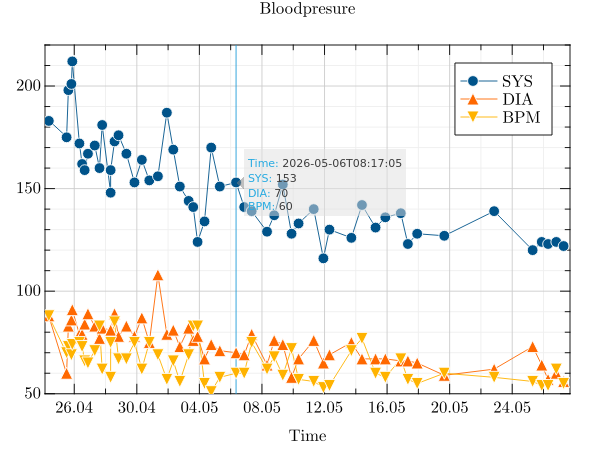
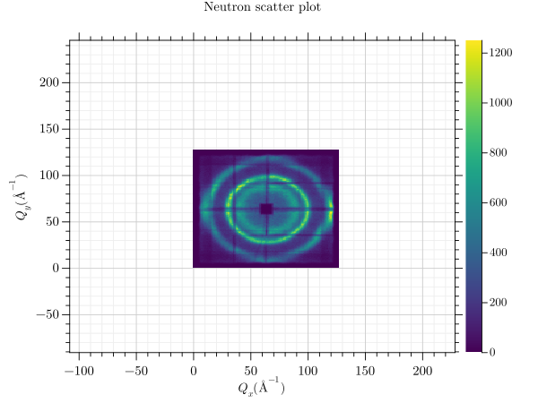
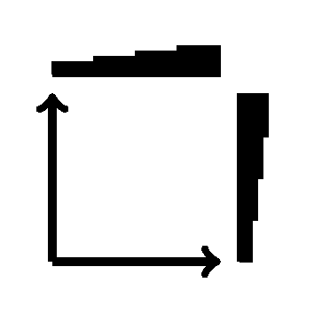
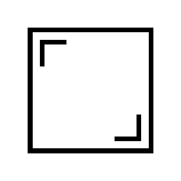

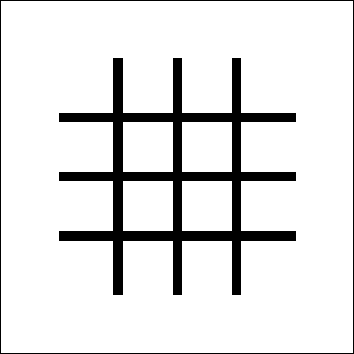
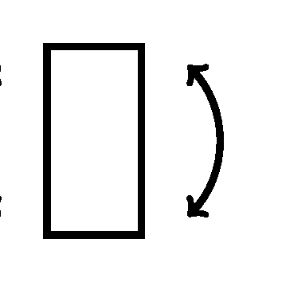
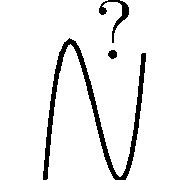
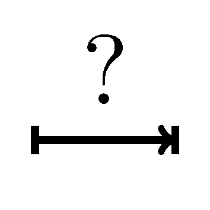
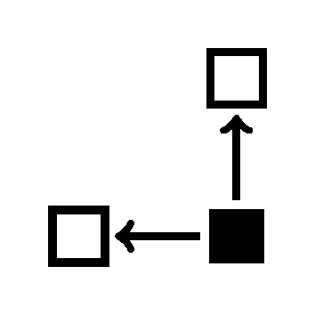
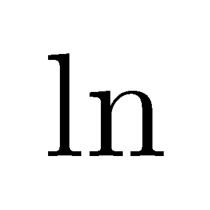
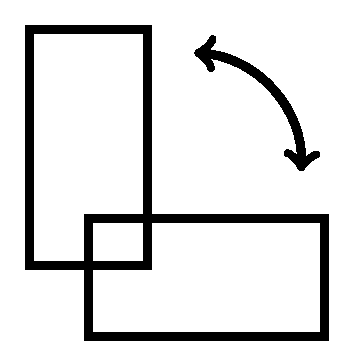
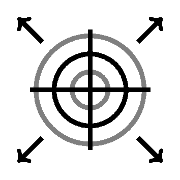

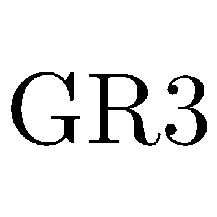
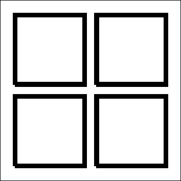
