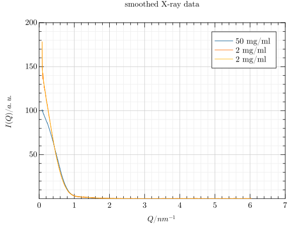
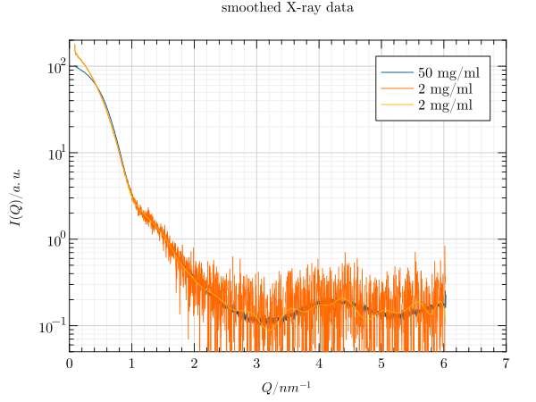
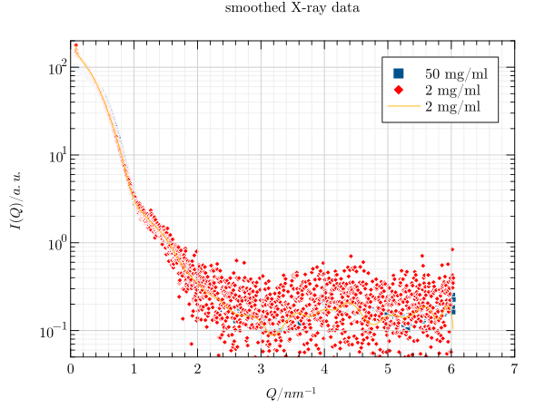
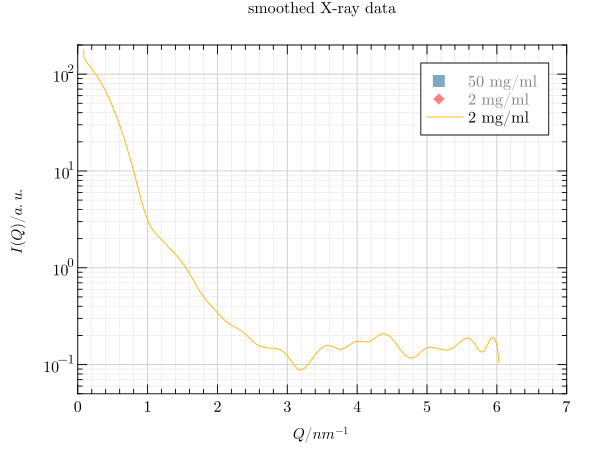
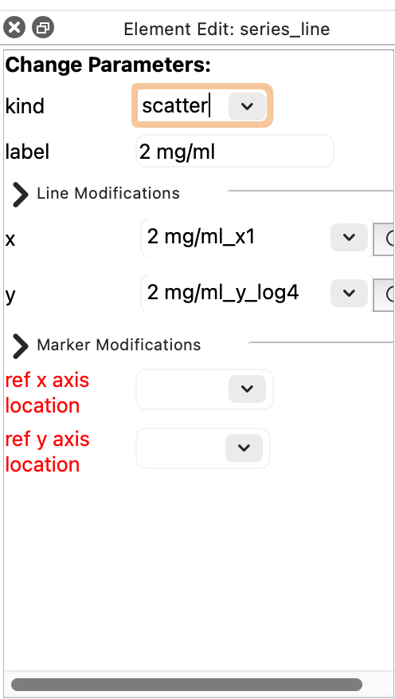
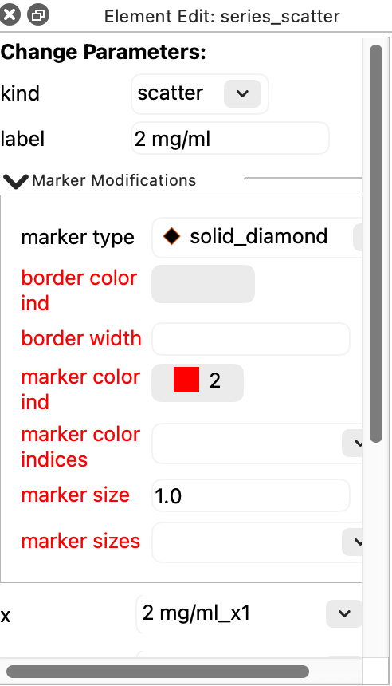
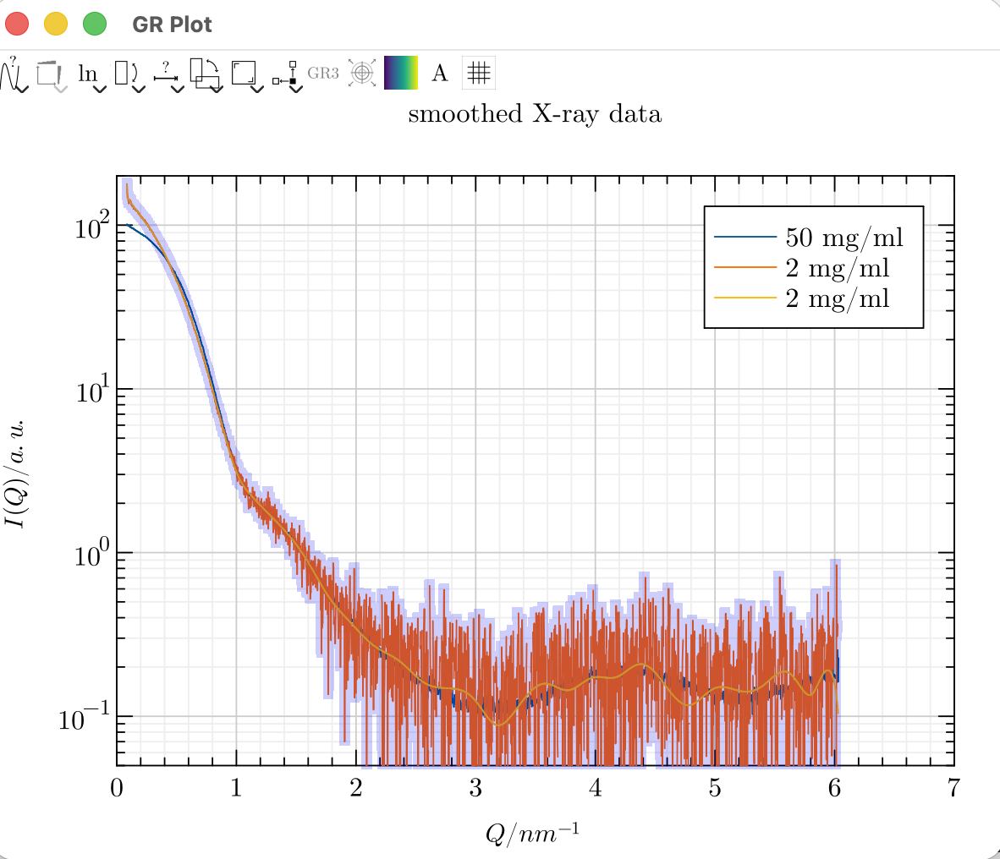
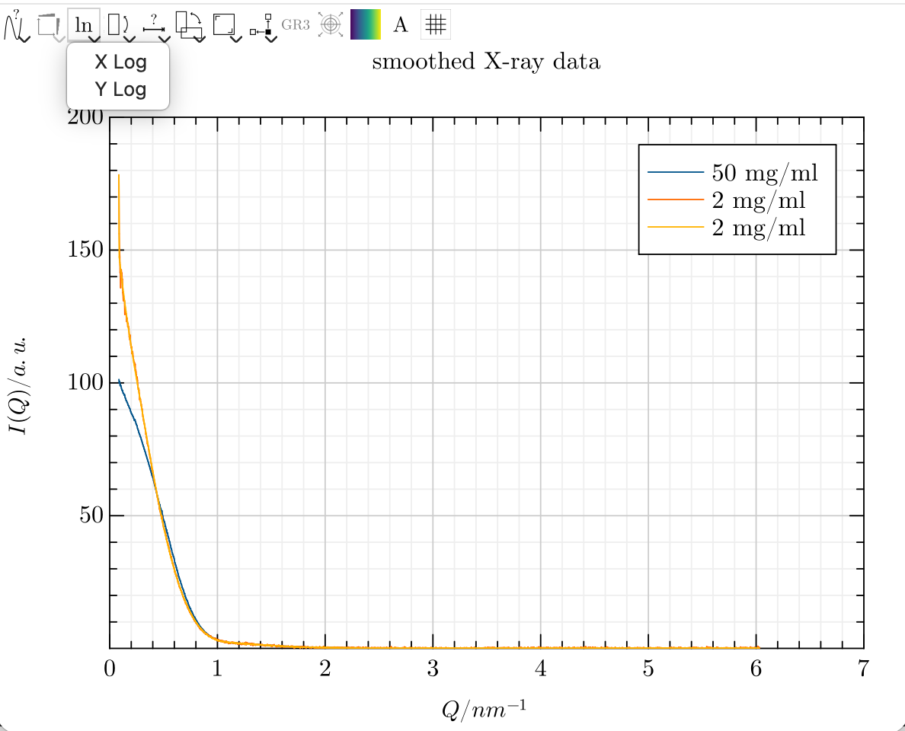

Tutorial
========

The following steps showcase a workflow with GRPlot. This tutorial uses the smooth_xraydata_ dataset.

Create the initial plot from the command line. The ``kind`` parameter declares that the data should be interpreted as a
line plot.

.. code-block:: bash

    grplot smooth_xraydata.dat kind:line

If ``kind`` is omitted, GRPlot trys to guess a suitable plot type based on the data file provided.

Key-value pairs can also be declared in the data header, which - in this example case - define the title and the axis
labels. These also include the y limits, which define the visible area of the y-axis and the labels of the three series.

.. code-block:: bash

  # title : smoothed X-ray data
  # x_label : $Q / nm^{-1}$
  # y_label : $I(Q) / a.u.$
  # y_lim : 0.05,200
  # x_columns:1
  # y_columns:2,3,4
  # legend: Q,50 mg/ml,2 mg/ml,2 mg/ml spline

The result is in the following image: |tutorial0|

As we cannot see much, we would like to use a logarithmic y-axis. This can be achieved using the toolbar.

|y_log| |tutorial1|

This is much better, but we would like to replace the blue and orange lines with a scatter plot. To do this, we first
need to enable the editor. Then, we select the desired series and change its type in the newly opened dock widget.

|enable_editor| |select_series| |change_kind|

Next, we select the new scatter plot and adjust the type, size and color of the marker.

|change_marker| |tutorial2| |tutorial3|

If we are only interested in one series, we can hide the others by deselecting them in the legend.

|tutorial4|

If known in advance, changes such as the use of a logarithmic y-axis or the combination of different types can be
achieved via key-value pairs on the command line. However, the size, color and type of the marker would still need to be
configured in the editor to recreate the same image.

.. code-block:: bash

    grplot smooth_xraydata.dat kind:scatter,,line y_log:1

.. _smooth_xraydata: https://gr-framework.org/downloads/grplot/example_data/smooth_xraydata.dat
