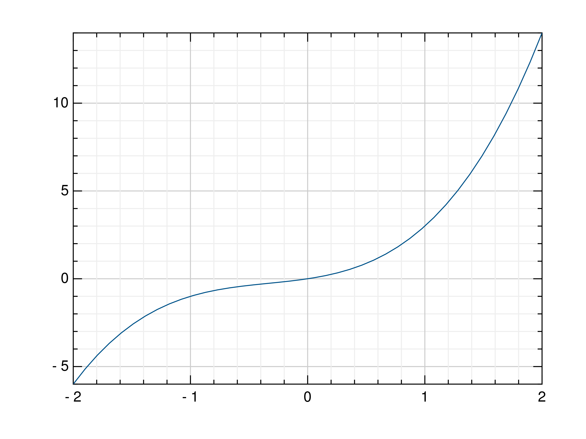

jlgr Reference
--------------

This module offers a simple, matlab-style API built on top of the GR package.

Output Functions
^^^^^^^^^^^^^^^^

Line Plots
""""""""""

.. jl:autofunction:: GR.jl/GR/src/jlgr.jl plot

.. jl:autofunction:: GR.jl/GR/src/jlgr.jl oplot

.. jl:autofunction:: GR.jl/GR/src/jlgr.jl plot3

.. jl:autofunction:: GR.jl/GR/src/jlgr.jl polar

Scatter Plots
"""""""""""""

.. jl:autofunction:: GR.jl/GR/src/jlgr.jl scatter

.. jl:autofunction:: GR.jl/GR/src/jlgr.jl scatter3

Stem Plots
""""""""""

.. jl:autofunction:: GR.jl/GR/src/jlgr.jl stem

Histograms
""""""""""

.. jl:autofunction:: GR.jl/GR/src/jlgr.jl histogram

.. jl:autofunction:: GR.jl/GR/src/jlgr.jl hexbin

Contour Plots
"""""""""""""

.. jl:autofunction:: GR.jl/GR/src/jlgr.jl contour

.. jl:autofunction:: GR.jl/GR/src/jlgr.jl contourf

.. jl:autofunction:: GR.jl/GR/src/jlgr.jl tricont

Surface Plots
"""""""""""""

.. jl:autofunction:: GR.jl/GR/src/jlgr.jl surface

.. jl:autofunction:: GR.jl/GR/src/jlgr.jl trisurf

.. jl:autofunction:: GR.jl/GR/src/jlgr.jl wireframe

Heatmaps
""""""""

.. jl:autofunction:: GR.jl/GR/src/jlgr.jl heatmap

Images
""""""

.. jl:autofunction:: GR.jl/GR/src/jlgr.jl imshow

Isosurfaces
"""""""""""

.. jl:autofunction:: GR.jl/GR/src/jlgr.jl isosurface

Attribute Functions
^^^^^^^^^^^^^^^^^^^

.. jl:autofunction:: GR.jl/GR/src/jlgr.jl title
.. jl:autofunction:: GR.jl/GR/src/jlgr.jl legend
.. jl:autofunction:: GR.jl/GR/src/jlgr.jl xlabel
.. jl:autofunction:: GR.jl/GR/src/jlgr.jl ylabel
.. jl:autofunction:: GR.jl/GR/src/jlgr.jl colormap

Control Functions
^^^^^^^^^^^^^^^^^

.. jl:autofunction:: GR.jl/GR/src/jlgr.jl figure
.. jl:autofunction:: GR.jl/GR/src/jlgr.jl subplot
.. jl:autofunction:: GR.jl/GR/src/jlgr.jl savefig
.. jl:autofunction:: GR.jl/GR/src/jlgr.jl hold
