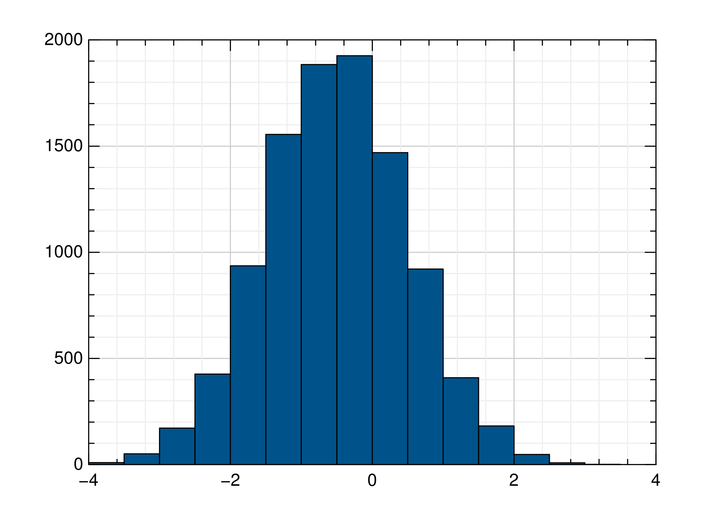

Julia Package GR
================

Installation
------------

For the Julia programming language an official
`GR.jl <https://github.com/jheinen/GR.jl>`_ package has been registered.
You can add the GR framework to your Julia installation with the
``Pkg.add()`` function:

.. code-block:: julia

    Pkg.add("GR")

This will automatically install both the GR runtime and the Julia wrapper. You may need to install some additional dependencies on Linux:

- Debian/Ubuntu:
   ``apt install libxt6 libxrender1 libgl1-mesa-glx``
- CentOS 7:
   ``yum install libXt libXrender libXext mesa-libGL``
- Fedora 26:
   ``dnf install libXt libXrender libXext mesa-libGL``
- openSUSE 42.3:
   ``zypper install libXt6 libXrender1 libXext6 Mesa-libGL1``

For information on building the GR runtime yourself, see the `Building the GR Runtime <building.rst>`_.

Getting Started
---------------

After installing GR, you can try it out by creating a simple plot.
Let’s start with a simple example. We generate 10,000 random numbers and
create a histogram. The histogram function automatically chooses an
appropriate number of bins to cover the range of values in x and show
the shape of the underlying distribution.

.. code-block:: julia

    using GR
    histogram(randn(10000))

Tutorials
---------

You can find several tutorials on using GR in the :doc:`Tutorials <tutorials/index>` section.

API Reference
-------------

The Julia API for GR consists of:

.. toctree::

    julia-gr.rst
    julia-jlgr.rst
    julia-gr3.rst
