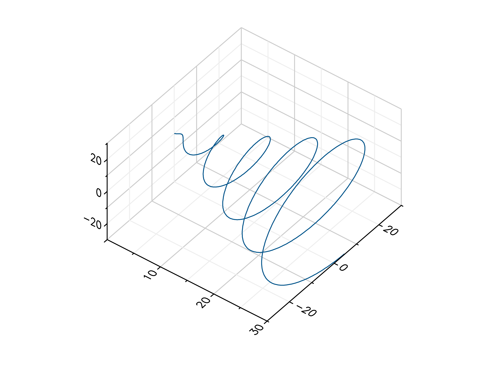
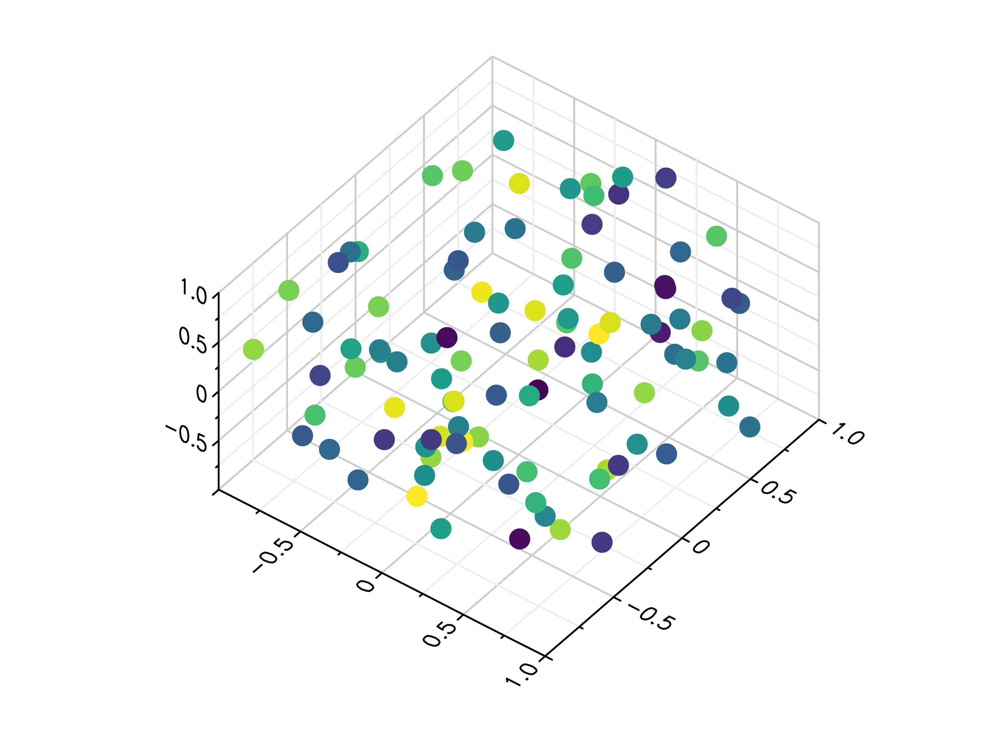

gr.pygr.mlab Reference
----------------------

.. automodule:: gr.pygr.mlab

Output Functions
^^^^^^^^^^^^^^^^

Line Plots
""""""""""

.. automethod:: gr.pygr.mlab.plot

.. automethod:: gr.pygr.mlab.oplot
.. image:: _static/img/mlab_plots/oplot.png

.. automethod:: gr.pygr.mlab.plot3

.. automethod:: gr.pygr.mlab.polar
.. image:: _static/img/mlab_plots/polar.png

Scatter Plots
"""""""""""""

.. automethod:: gr.pygr.mlab.scatter

.. automethod:: gr.pygr.mlab.scatter3

Quiver Plots
"""""""""""""

.. automethod:: gr.pygr.mlab.quiver
.. image:: _static/img/mlab_plots/quiver.png

Stem Plots
""""""""""

.. automethod:: gr.pygr.mlab.stem
.. image:: _static/img/mlab_plots/stem.png

Histograms
""""""""""

.. automethod:: gr.pygr.mlab.histogram
.. image:: _static/img/mlab_plots/histogram.png

.. automethod:: gr.pygr.mlab.hexbin

Contour Plots
"""""""""""""

.. automethod:: gr.pygr.mlab.contour

.. automethod:: gr.pygr.mlab.contourf
.. image:: _static/img/mlab_plots/contourf.png

.. automethod:: gr.pygr.mlab.tricont

Surface Plots
"""""""""""""

.. automethod:: gr.pygr.mlab.surface
.. image:: _static/img/mlab_plots/surface.png

.. automethod:: gr.pygr.mlab.trisurf
.. image:: _static/img/mlab_plots/trisurf.png

.. automethod:: gr.pygr.mlab.wireframe

Heatmaps
""""""""

.. automethod:: gr.pygr.mlab.heatmap

Images
""""""

.. automethod:: gr.pygr.mlab.imshow
.. image:: _static/img/mlab_plots/imshow.png

Isosurfaces
"""""""""""

.. automethod:: gr.pygr.mlab.isosurface

Attribute Functions
^^^^^^^^^^^^^^^^^^^

.. automethod:: gr.pygr.mlab.title
.. automethod:: gr.pygr.mlab.legend
.. automethod:: gr.pygr.mlab.xlabel
.. automethod:: gr.pygr.mlab.ylabel
.. automethod:: gr.pygr.mlab.zlabel
.. automethod:: gr.pygr.mlab.xlim
.. automethod:: gr.pygr.mlab.ylim
.. automethod:: gr.pygr.mlab.zlim
.. automethod:: gr.pygr.mlab.xlog
.. automethod:: gr.pygr.mlab.ylog
.. automethod:: gr.pygr.mlab.zlog
.. automethod:: gr.pygr.mlab.xflip
.. automethod:: gr.pygr.mlab.yflip
.. automethod:: gr.pygr.mlab.zflip
.. automethod:: gr.pygr.mlab.rotation
.. automethod:: gr.pygr.mlab.tilt
.. automethod:: gr.pygr.mlab.colormap

Control Functions
^^^^^^^^^^^^^^^^^

.. automethod:: gr.pygr.mlab.figure
.. automethod:: gr.pygr.mlab.subplot
.. automethod:: gr.pygr.mlab.savefig
.. automethod:: gr.pygr.mlab.hold
