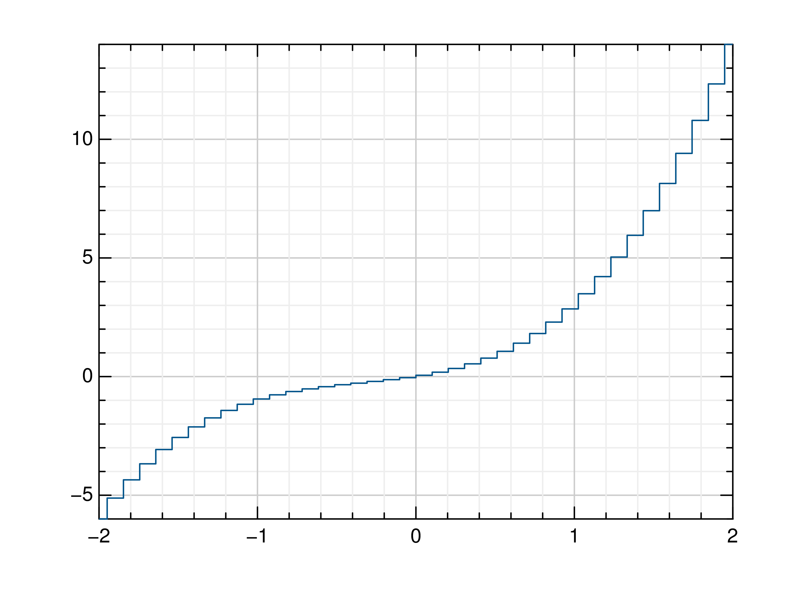
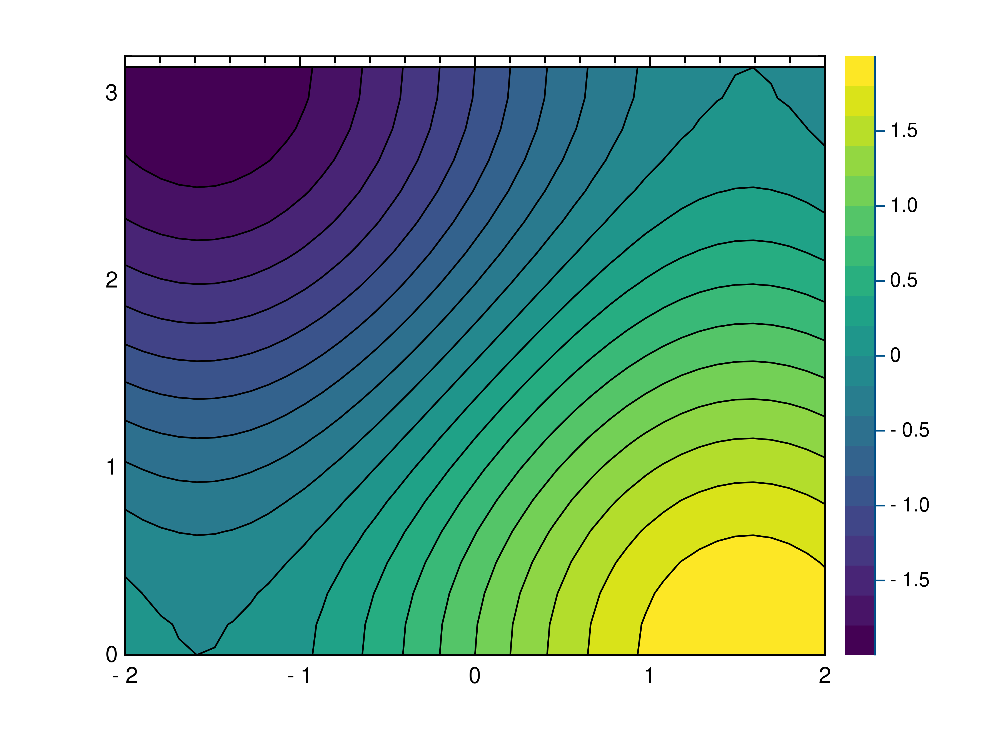
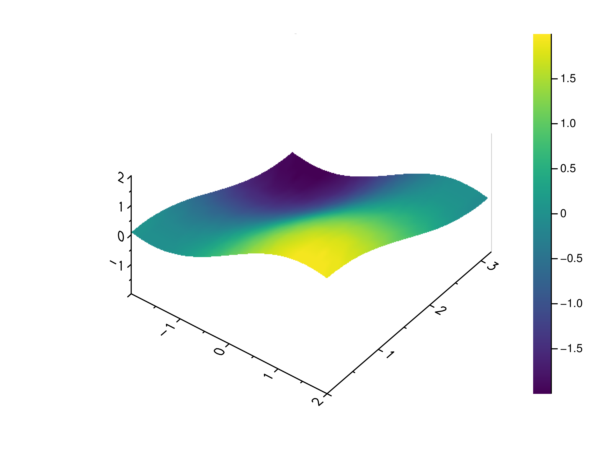
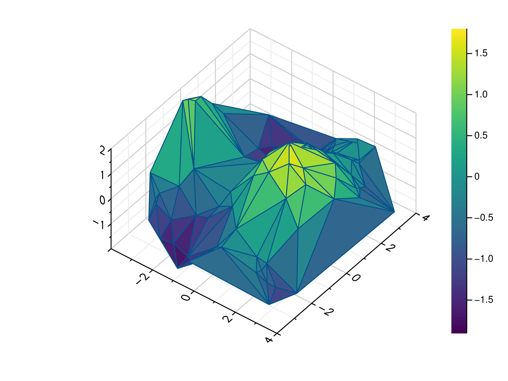

gr.pygr.mlab Reference
----------------------

.. automodule:: gr.pygr.mlab

Output Functions
^^^^^^^^^^^^^^^^

Line Plots
""""""""""

.. autofunction:: gr.pygr.mlab.plot
.. image:: _static/img/mlab_plots/plot.png

.. autofunction:: gr.pygr.mlab.oplot

.. autofunction:: gr.pygr.mlab.step

.. autofunction:: gr.pygr.mlab.plot3
.. image:: _static/img/mlab_plots/plot3.png

.. autofunction:: gr.pygr.mlab.polar

Scatter Plots
"""""""""""""

.. autofunction:: gr.pygr.mlab.scatter
.. image:: _static/img/mlab_plots/scatter.png

.. autofunction:: gr.pygr.mlab.scatter3
.. image:: _static/img/mlab_plots/scatter3.png

Quiver Plots
"""""""""""""

.. autofunction:: gr.pygr.mlab.quiver

Stem Plots
""""""""""

.. autofunction:: gr.pygr.mlab.stem

Bar Plots
"""""""""

.. autofunction:: gr.pygr.mlab.bar

Histograms
""""""""""

.. autofunction:: gr.pygr.mlab.histogram

.. autofunction:: gr.pygr.mlab.polar_histogram

.. autofunction:: gr.pygr.mlab.hexbin
.. image:: _static/img/mlab_plots/hexbin.png

Contour Plots
"""""""""""""

.. autofunction:: gr.pygr.mlab.contour
.. image:: _static/img/mlab_plots/contour.png

.. autofunction:: gr.pygr.mlab.contourf

.. autofunction:: gr.pygr.mlab.tricont
.. image:: _static/img/mlab_plots/tricont.png

Surface Plots
"""""""""""""

.. autofunction:: gr.pygr.mlab.surface

.. autofunction:: gr.pygr.mlab.trisurf

.. autofunction:: gr.pygr.mlab.wireframe
.. image:: _static/img/mlab_plots/wireframe.png

Heatmaps
""""""""

.. autofunction:: gr.pygr.mlab.heatmap
.. image:: _static/img/mlab_plots/heatmap.png

.. autofunction:: gr.pygr.mlab.shade

Images
""""""

.. autofunction:: gr.pygr.mlab.imshow

Isosurfaces
"""""""""""

.. autofunction:: gr.pygr.mlab.isosurface
.. image:: _static/img/mlab_plots/isosurface.png

Volume Rendering
""""""""""""""""

.. autofunction:: gr.pygr.mlab.volume

Attribute Functions
^^^^^^^^^^^^^^^^^^^

.. autofunction:: gr.pygr.mlab.title
.. autofunction:: gr.pygr.mlab.legend
.. autofunction:: gr.pygr.mlab.xlabel
.. autofunction:: gr.pygr.mlab.ylabel
.. autofunction:: gr.pygr.mlab.zlabel
.. autofunction:: gr.pygr.mlab.dlabel
.. autofunction:: gr.pygr.mlab.xlim
.. autofunction:: gr.pygr.mlab.ylim
.. autofunction:: gr.pygr.mlab.zlim
.. autofunction:: gr.pygr.mlab.xlog
.. autofunction:: gr.pygr.mlab.ylog
.. autofunction:: gr.pygr.mlab.zlog
.. autofunction:: gr.pygr.mlab.xflip
.. autofunction:: gr.pygr.mlab.yflip
.. autofunction:: gr.pygr.mlab.zflip
.. autofunction:: gr.pygr.mlab.rotation
.. autofunction:: gr.pygr.mlab.tilt
.. autofunction:: gr.pygr.mlab.colormap

Control Functions
^^^^^^^^^^^^^^^^^

.. autofunction:: gr.pygr.mlab.figure
.. autofunction:: gr.pygr.mlab.subplot
.. autofunction:: gr.pygr.mlab.savefig
.. autofunction:: gr.pygr.mlab.hold
