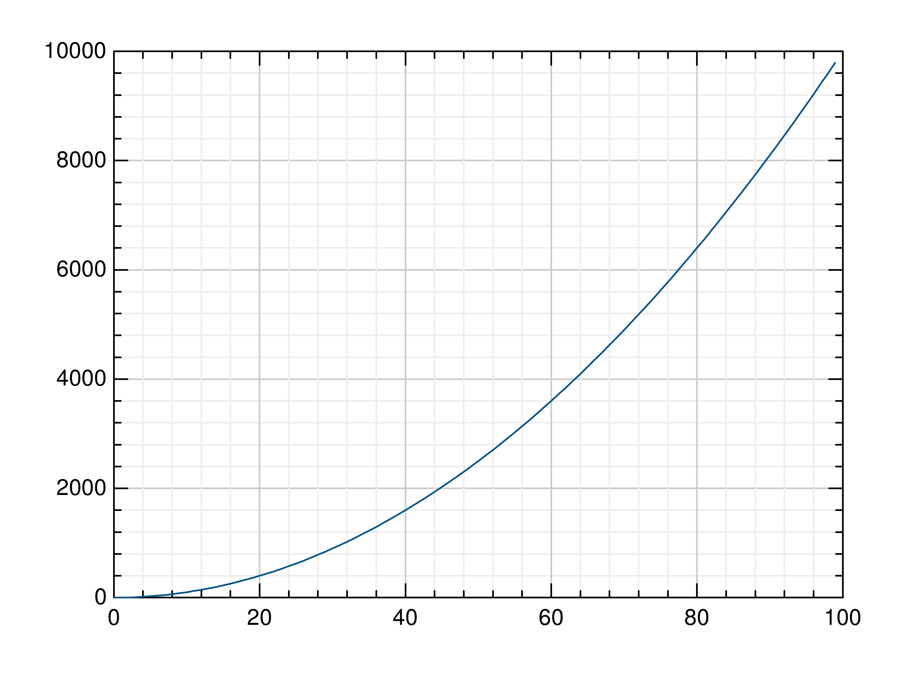

Python Package gr
=================

Installation
------------

GR is available on `PyPI <https://pypi.python.org/pypi/gr/>`_ and we recommend installing it with pip:

.. code-block:: bash

   pip install gr

This will automatically install both the GR runtime and the Python wrapper. You may need to install some additional dependencies on Linux:

- Debian:
   ``apt install libxt6 libxrender1 libxext6 libgl1-mesa-glx libqt6widgets6``
- Ubuntu:
   ``apt install libxt6 libxrender1 libxext6 libglx-mesa0 libqt6widgets6``
- CentOS / Fedora / Rocky Linux:
   ``yum install libXt libXrender libXext mesa-libGL qt6-qtbase-gui``
- openSUSE:
   ``zypper install libXt6 libXrender1 libXext6 Mesa-libGL1 libQt6Widgets6``
- Arch Linux:
   ``pacman -S mesa qt6-base``

**Note**: Depending on the Linux flavor you are using, the package names may differ from the ones mentioned here. This particularly applies to the Qt versions used.

On FreeBSD make sure to install the these packages:
   ``pkg install libXt libXrender libXext mesa-libs qt6``

For information on building the GR runtime yourself, see
`Building the GR Runtime <building.html>`_.

Docker and other headless Linux systems
^^^^^^^^^^^^^^^^^^^^^^^^^^^^^^^^^^^^^^^

- GR does not rely on X11 for its non-interactive output formats, so you will
  not need the dependencies listed above on a headless system.
- GR3 uses GLX for OpenGL context creation, which requires a connection to an X
  server. If you are using a headless sytem, e.g. a Docker container, you can
  use Xvfb or similar tools to start an X server that can be used by GR3,
  although it may only provide software rendering.

Getting Started
---------------

After installing GR, you can try it out by creating a simple plot:

.. code-block:: python

   from gr.pygr import mlab
   mlab.plot(range(100), lambda x: x**2)

Tutorials
---------

You can find several tutorials on using GR in the :doc:`Tutorials <tutorials/index>` section.

Examples
--------

You can find a collection of Python scripts using GR in the :doc:`Examples <examples/index>` section.

API Reference
-------------

The Python API for GR consists of:

.. toctree::

    python-gr.rst
    python-gr-pygr.rst
    python-gr-pygr-mlab.rst
    python-gr3.rst
    python-grm.rst
