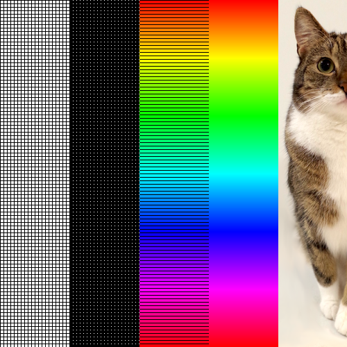
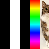
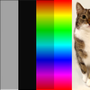
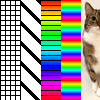
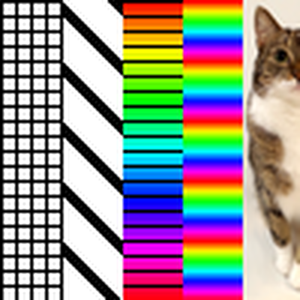

.. _resampling_methods:

Resampling Methods
------------------

When drawing RGBA images, e.g. using :c:func:`gr_drawimage`, the resolution of the image data and the size of the area where the image should be drawn often don't match. In workstation types which produce vector-based files, this issue is left to viewing programs, which will need to rasterize the file to display it. For raster output like PNGs, GKS has to handle this resolution mismatch itself.

Before GR Runtime version 0.42.0, image data would always be resampled to the required resolution using the nearest neighbor algorithm, which is very fast but can lead to a few issues, particularly when reducing the resolution of image data, as the information of some pixels will be ignored and lost to the viewer. To avoid this and offer alternatives, GKS now supports two other algorithms: `linear <https://en.wikipedia.org/wiki/Bilinear_interpolation#Application_in_image_processing>`_ and `Lanczos <https://en.wikipedia.org/wiki/Lanczos_resampling>`_ resampling.

The algorithm to be used can be set individually for four cases:

- downsampling horizontally,
- downsampling vertically,
- upsampling horizontally, and
- upsampling vertically.

To do so, the user can combine flags for each situation, e.g. ``GKS_DOWNSAMPLE_HORIZONTAL_LINEAR | GKS_DOWNSAMPLE_VERTICAL_LINEAR`` and pass the result to :c:func:`gr_setresamplemethod`. Alternatively, they can use a pre-combined flag such as ``GKS_RESAMPLE_LINEAR``.

If no resampling method is selected, the default resampling method will be used. Usually, this will be the nearest neighbor algorithm, but this can be changed using the ``GKS_DEFAULT_RESAMPLE_METHOD`` :ref:`environment variable <environment variables>`.

.. note::

    Using linear or Lanczos resampling will be significantly slower than the nearest neighbor approach.

Examples
````````

The following example shows a 500×500 pixels image downsampled to 100×100 pixels using these three algorithms:



   Original Image



   Nearest Neighbor Downsampling


   Linear Downsampling



   Lanczos Downsampling

The next example shows the reverse, a 100×100 pixels image upsampled to 500×500 pixels:




   Original Image


   Nearest Neighbor Upsampling


   Linear Upsampling



   Lanczos Upsampling
