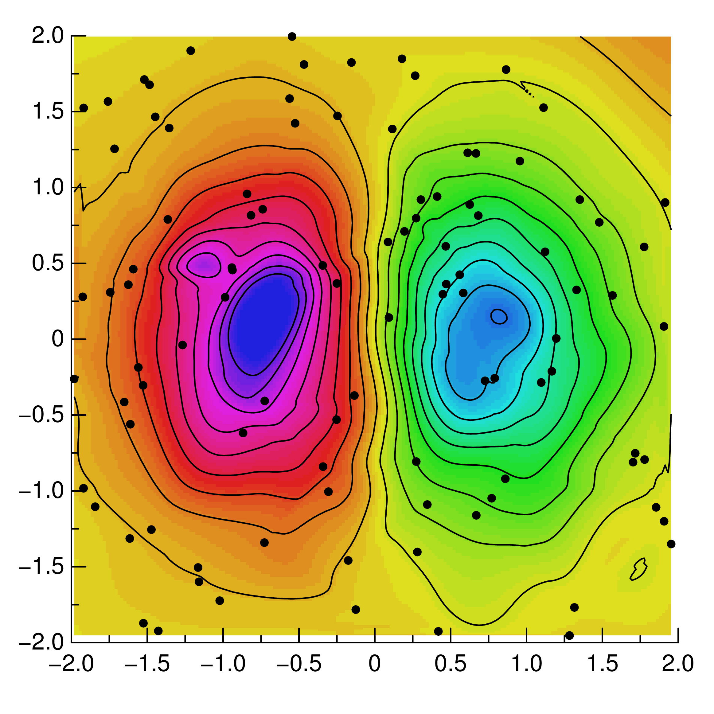

Using the GR framework in Fortran
^^^^^^^^^^^^^^^^^^^^^^^^^^^^^^^^^

As a C library GR can not only be used directly in C and C++ or with a
wrapper in `Python <../python.html>`_ and `Julia <../julia.html>`_, but it can
also be called from Fortran, e.g. using the *GNU Fortran* compiler.

When using GR in Fortran, you will need to define the GR and GKS integer
constants yourself, e.g. for `GKS_K_MARKERTYPE_SOLID_CIRCLE` as seen below,
and it is important to use double precision constants for floating point
parameters. Aside from these caveats, you can refer directly to the
`API reference for the C library GR <../c-gr.html>`_.

The following example shows how GR can be used in Fortran to create a
contour plot of unstructured two dimensional data:

.. code-block:: fortran

    C
    C   gfortran griddata.f -L/usr/local/gr/lib -lGR
    C
          program griddata
    C
          integer GKS_K_MARKERTYPE_SOLID_CIRCLE
          parameter (GKS_K_MARKERTYPE_SOLID_CIRCLE = -1)
    C
          double precision xd(100), yd(100), zd(100)
          double precision x(200), y(200), z(200, 200)
          double precision h(20)
          integer i
    C
          call srand(0)
          do 1 i = 1, 100
              xd(i) = -2 + 4 * rand()
              yd(i) = -2 + 4 * rand()
              zd(i) = xd(i) * exp(-xd(i)*xd(i) - yd(i)*yd(i))
      1   continue
    C
          call gr_setviewport(0.1D0, 0.95D0, 0.1D0, 0.95D0)
          call gr_setwindow(-2.0D0, 2.0D0, -2.0D0, 2.0D0)
          call gr_setspace(-0.5D0, 0.5D0, 0, 90)
          call gr_setmarkersize(1.0D0)
          call gr_setmarkertype(GKS_K_MARKERTYPE_SOLID_CIRCLE)
          call gr_setcharheight(0.024D0)
          call gr_settextalign(2, 0)
          call gr_settextfontprec(3, 0)
    C
          call gr_gridit(100, xd, yd, zd, 200, 200, x, y, z)
          do 2 i = 1, 20
            h(i) = -0.5 + i / 19.0
      2   continue
    C
          call gr_surface(200, 200, x, y, z, 5)
          call gr_contour(200, 200, 20, x, y, h, z, 0)
          call gr_polymarker(100, xd, yd)
          call gr_axes(0.25D0, 0.25D0, -2D0, -2D0, 2, 2, 0.01D0)
    C
          call gr_updatews()
          end

The result will be exactly the same as if you had used a different programming
language, except for slight differences due to the underlying random number
generators.

