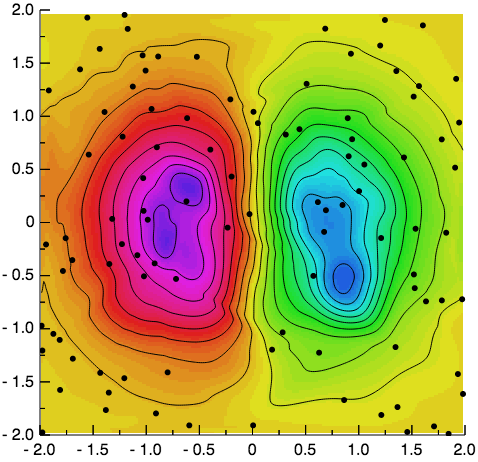

Using the GR framework in JavaScript
^^^^^^^^^^^^^^^^^^^^^^^^^^^^^^^^^^^^

As a C library GR can not only be used directly in C and C++ or with a
wrapper in `Python <../python.html>`_ and `Julia <../julia.html>`_, but it can
also be compiled using `emscripten <https://kripken.github.io/emscripten-site/>`_
and used in JavaScript.

To use GR in JavaScript, you will need to include **gr.js**, which you can
either `download <https://gr-framework.org/downloads/gr-latest.js>`_
or build directly from the source code. You can then pass a function to
:js:func:`GR.ready`, which will be called once GR is loaded and ready for use.

Next you can create a GR object, which will expose an interface similar to the
`API for the C library GR <../c-gr.html>`_. This object will then draw onto a
canvas object identified by the ID specified during its creation or, if no ID
is passed to the call of ``new GR()``, by the default ID ``canvas``.

The following example shows how GR can be used in JavaScript to create a
contour plot of unstructured two dimensional data:

.. code-block:: html

    <!doctype html>
    <html lang="en-us">
    <head>
      <meta charset="utf-8">
      <title>Grid data example using gr.js</title>
    </head>
    <body>
      <canvas id="example-canvas" width="500" height="500"></canvas>
      
      
    </body>
    </html>

Compared to including static PNG images, the key advantage of
using GR in JavaScript is that you can create images and animations at runtime,
allowing interactivity and the client-side visualization of live data.

The following example uses GR with :js:func:`window.requestAnimationFrame`
to draw an animated plot of (random) live data:

.. code-block:: javascript

    // Set up x and y values
    var x = new Array(201);
    var y = new Array(201);
    for (var i = 0; i < 201; i++) {
      x[i] = 2 * i / 200;
    }
    y[0] = 0;
    for (var i = 1; i < 201; i++) {
      y[i] = 0.9*y[i-1] + 0.4 * Math.random() - 0.2;
    }

    GR.ready(function() {
      var gr = new GR('example-canvas');

      function onFrame() {
        // Update x and y values
        for (var i = 0; i < 200; i++) {
          y[i] = y[i+1];
          x[i] = x[i+1];
        }
        y[200] = 0.9*y[200] + 0.4* Math.random() - 0.2;
        x[200] = x[199] + 0.01;

        // Draw new frame
        gr.clearws();
        gr.setviewport(0.1, 0.95, 0.1, 0.95);
        gr.setwindow(x[0], x[200], -1, 1);
        gr.grid(0.25, 0.25, 0, 0, 2, 2);
        gr.axes(0.25, 0.25, x[0], -1, 2, 2, 0.005);
        gr.axes(0.25, 0.25, x[200], 1, -2, -2, -0.005);
        gr.polyline(200, x, y);
        gr.textext(0.37, 0.97, "Plot Animation Demo");
        gr.textext(0.5, 0.01, "x");
        gr.textext(0.01, 0.525, "y");

        // Request to be called for the next frame
        window.requestAnimationFrame(onFrame);
      };
      window.requestAnimationFrame(onFrame);
    });

.. raw:: html

   <canvas id="example-canvas" width="500" height="500"></canvas>
   

   

