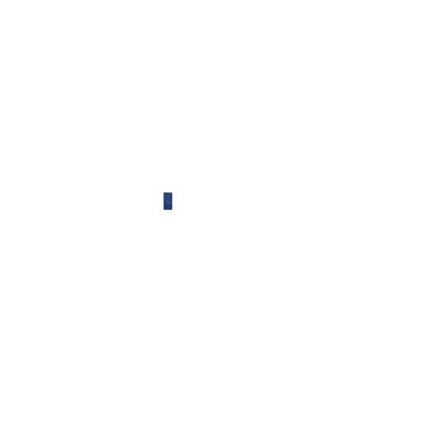
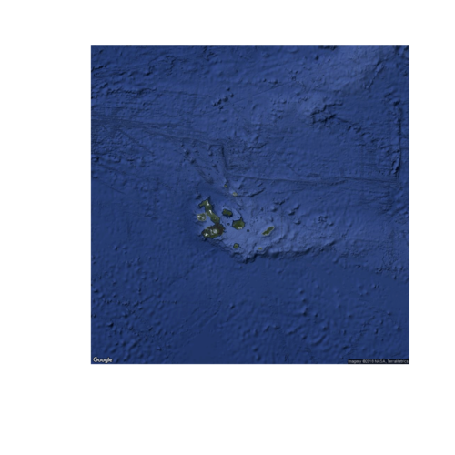
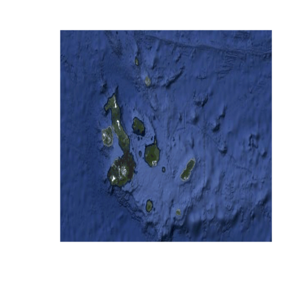
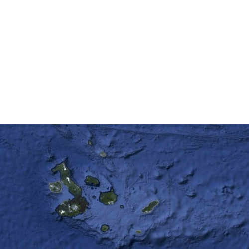

Using windows and viewports
===========================

To position content, GR and GKS perform a series of transformations from the coordinates you work with to the final coordinates on the screen or an image file.

The coordinates you work with can be in whatever range you want and are purely chosen by you. The space they lie in is usually called the **world space**. Maybe you do not want to include all of this world space in an image, but only a rectangular section of it. This section of **world space** that you are interested in is called the **window** and can be set using the `setwindow` function.

After selecting this **window** in **world coordinates**, you need to decide where it should be placed on your output image. For this, GR and GKS work with **normalized device coordinates**, with a range between 0 and 1 in both axes, with (0, 0) being the lower left corner and (1, 1) being the upper right corner of your output. The rectangular region in the output image onto which you want to draw the content inside your **window** is called the **viewport**. To set the **viewport**, you can use the `setviewport` function.

In the following example, we will use the window and viewport to position a `satellite image of the Galapagos Archipelago <../_static/galapagos_example.png>`_, which is conveniently located at 0˚ latitude and -90˚ longitude, with the image capturing ±5˚ of both. We will use longitude as x coordinates and latitude as y coordinates in this example, thereby defining our **world space**. First, we open the image and read its width, height and pixel data:

.. code-block:: python

    import gr
    width, height, image = gr.readimage("galapagos_example.png")

.. code-block:: c

    #include <gr.h>

    /* ... */

    int width = 0;
    int height = 0;
    int *image = NULL;
    gr_readimage("galapagos_example.png", &width, &height, &image);

In the next step, we naively draw this image at its correct location:

.. code-block:: python

    gr.drawimage(-95, -85, -5, 5, width, height, image)
    gr.updatews()

.. code-block:: c

    gr_drawimage(-95, -85, -5, 5, width, height, image, 0);
    gr_updatews();

The result? Nothing. The default **window** is set to [0, 1] × [0, 1] and therefore the image is not drawn. To mitigate this, we can use `setwindow`. With longitude ranging from -180 to 180 and latitude ranging from -90 to 90, we could do the following:

.. code-block:: python

    gr.setwindow(-180, 180, -90, 90)
    gr.drawimage(-95, -85, -5, 5, width, height, image)
    gr.updatews()

.. code-block:: c

    gr_setwindow(-180, 180, -90, 90);
    gr_drawimage(-95, -85, -5, 5, width, height, image, 0);
    gr_updatews();

This results in a small blue rectangle where our satellite image is drawn, but it is far too small to work with. Instead of using all of earth as our **window**, you can focus on the region shown on the image by using a different set of parameters for `setwindow`:

.. code-block:: python

    gr.setwindow(-95, -85, -5, 5)
    gr.drawimage(-95, -85, -5, 5, width, height, image)
    gr.updatews()

.. code-block:: c

    gr_setwindow(-95, -85, -5, 5);
    gr_drawimage(-95, -85, -5, 5, width, height, image, 0);
    gr_updatews();

This way we can properly see the contents of the image, but with it containing ±5˚ longitude and latitude around the archipelago, we might adjust our window further to show only the region we are really interested in:

.. code-block:: python

    gr.setwindow(-92.75, -87.25, -1.75, 1)
    gr.drawimage(-95, -85, -5, 5, width, height, image)
    gr.updatews()

.. code-block:: c

    gr_setwindow(-92.75, -87.25, -1.75, 1);
    gr_drawimage(-95, -85, -5, 5, width, height, image, 0);
    gr_updatews();

The **window** has a range of 5.5˚ latitude and 2.75˚ longitude, so it appears distorted when drawn as a square. Instead of using the default **viewport**, you can instead use `setviewport` to pick one that is shaped correctly and positioned to include the lower left corner of our output, (0, 0) in **normalized device coordinates**, and the middle of our output's right side, (1, 0.5):

.. code-block:: python

    gr.setviewport(0, 1, 0, 0.5)
    gr.setwindow(-92.75, -87.25, -1.75, 1)
    gr.drawimage(-95, -85, -5, 5, width, height, image)
    gr.updatews()

.. code-block:: c

    gr_setviewport(0, 1, 0, 0.5);
    gr_setwindow(-92.75, -87.25, -1.75, 1);
    gr_drawimage(-95, -85, -5, 5, width, height, image, 0);
    gr_updatews();

To summarize: **The window controls what region of your world space is drawn and the viewport controls which region of your output it is drawn on.**
